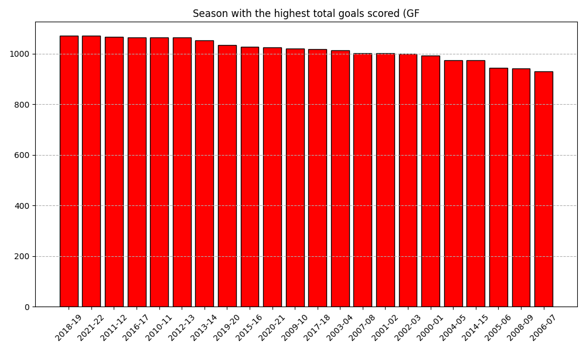
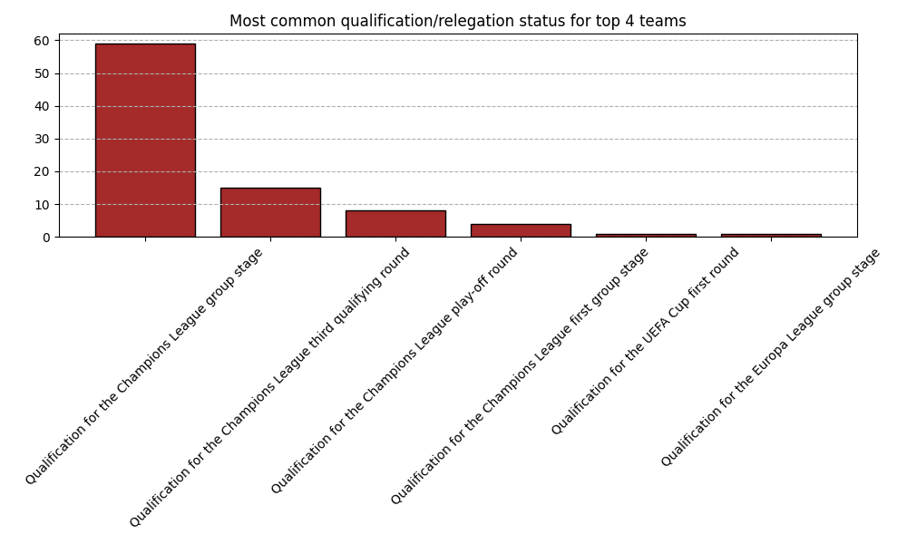

## Introduction
The epl_cleaned.csv is a cleaned dataset of English Premier League (EPL) season standings. It contains season-by-season data for each team’s performance in the league, with columns describing key statistics such as matches played, wins, draws, losses, goals scored, goals conceded, goal difference, points earned, and whether the team qualified for European competitions or was relegated from 2000 to 2022

### Data Cleaning and Preprocessing
```python
import pandas as pd

# Load the dataset
df = pd.read_csv("datasets/epl.csv")

# Step 1: Clean the "Qualification or relegation" column by removing bracketed text
df["Qualification or relegation"] = df["Qualification or relegation"].str.replace(r'/[.+]', "",regex=True).str.strip()

# Step 2: Save the cleaned DataFrame to a new CSV file
df.to_csv("datasets/epl_cleaned.csv")
print("Saved Successfully")
```
### Database and Table Setup
```sql
-- Create the database schema
CREATE SCHEMA IF NOT EXISTS `epl`;
USE `epl`;

-- Drop table if it exists (for clean setup)
DROP TABLE IF EXISTS premier_league_standings;

-- Create the main table
CREATE TABLE premier_league_standings (
    id INT AUTO_INCREMENT PRIMARY KEY,
    season VARCHAR(9) NOT NULL,
    position INT NOT NULL,
    team VARCHAR(100) NOT NULL,
    played INT NOT NULL,
    won INT NOT NULL,
    drawn INT NOT NULL,
    lost INT NOT NULL,
    goals_for INT NOT NULL,
    goals_against INT NOT NULL,
    goal_difference INT NOT NULL,
    points INT NOT NULL,
    qualification_or_relegation TEXT,
    
    -- Add indexes for common queries
    INDEX idx_season (season),
    INDEX idx_team (team),
    INDEX idx_position (position),
    INDEX idx_points (points),
    
    -- Add constraints
    CHECK (position >= 1 AND position <= 20),
    CHECK (played = won + drawn + lost),
    CHECK (goal_difference = goals_for - goals_against),
    CHECK (points = (won * 3) + drawn),
    CHECK (played = 38)
);

```

### Analysis
Here are 10 analytical questions you can answer using SQL:

1. Which team has won the most Premier League titles across all seasons?

2. What is the average number of points scored by teams each season?

3. Which season had the highest total goals scored (GF) by all teams combined?

4. For each season, which team had the best goal difference (GD)?

5. Which team has conceded the fewest goals (GA) in a single season?

6. What is the average number of wins (W) for teams finishing in the top 4 positions?

7. Which team had the highest points total (Pts) without winning the league?

8. What is the trend of total goals scored per season over time?

9. Which qualification/relegation status is most common for teams finishing in positions 1–4?

10. Which teams have been relegated the most times across all seasons? 

#### Which team has won the most Premier League titles across all seasons?
```sql
SELECT team,COUNT(*) AS titles_won
FROM premier_league_standings
WHERE position = 1
GROUP BY team
ORDER BY titles_won DESC
LIMIT 1;
```


#### What is the average number of points scored by teams each season?
```sql
SELECT season,AVG(points) AS avg_points
FROM premier_league_standings
GROUP BY season
ORDER BY season;
```


#### Which season had the highest total goals scored (GF) by all teams combined?
```sql
SELECT season,sum(goals_for) AS total_goals
FROM premier_league_standings
GROUP BY season
ORDER BY total_goals DESC
LIMIT 1;
```


#### For each season, which team had the best goal difference (GD)?
```sql
SELECT season,team,goals_for
FROM premier_league_standings
WHERE (season,goals_for) IN (
    SELECT season,MAX(goals_for)
    FROM premier_league_standings
    GROUP BY season
)
ORDER BY season;
```


#### Which team has conceded the fewest goals (GA) in a single season?
```sql
SELECT season,team,goals_against
FROM premier_league_standings
ORDER BY goals_against ASC
LIMIT 1;
```

#### What is the average number of wins (W) for teams finishing in the top 4 positions?
```sql
SELECT AVG(won) AS avg_wins_top4
FROM premier_league_standings
WHERE position IN (1,2,3,4);
```

#### Which team had the highest points total (Pts) without winning the league?
```sql
SELECT season,team,points
FROM premier_league_standings
WHERE position != 1
ORDER BY points DESC
LIMIT 1;
```

#### What is the trend of total goals scored per season over time?
```sql
SELECT season,SUM(goals_for) AS total_goals
FROM premier_league_standings
GROUP BY season
ORDER BY season;
```


#### Which qualification/relegation status is most common for teams finishing in positions 1–4?
```sql
SELECT qualification_or_relegation,COUNT(*) AS freq
FROM premier_league_standings
WHERE position IN (1,2,3,4)
GROUP BY qualification_or_relegation
ORDER BY freq DESC
LIMIT 1;
```


#### Which teams have been relegated the most times across all seasons? 
```sql
SELECT team,COUNT(*) AS relegations
FROM premier_league_standings
WHERE qualification_or_relegation LIKE '%Relegation%'
GROUP BY team
ORDER BY relegations DESC;
```
